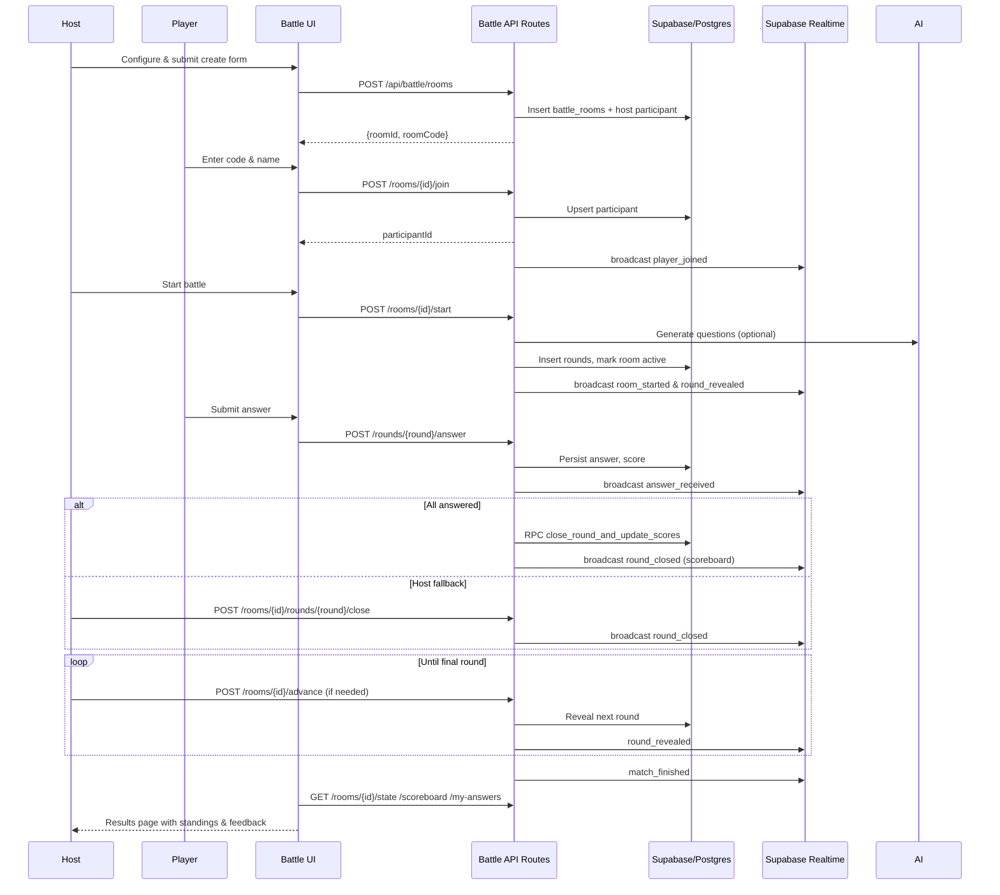

# Battle Feature Documentation

## Overview
- Battle Arena delivers real-time, head-to-head quiz sessions where a room host invites challengers, kicks off timed rounds, and compares scores in live leaderboards.
- Players interact entirely through the web client: creating or joining rooms, answering open-ended or multiple-choice questions, and reviewing round-by-round feedback.
- The feature showcases the portfolio’s real-time capabilities, supports future growth (team modes, AI extensions), and centralises quiz battle logic for maintenance or enhancements.

## Core Features

### Feature Catalogue
- **Room creation & configuration** – Hosts provision rooms with topic, language, question count, timer, capacity, and question type (`open-ended` vs `multiple-choice`) via `POST /api/battle/rooms`.
- **Session-aware room join** – Participants join by room ID/code with automatic session fingerprinting and capacity/status validation (`POST /api/battle/rooms/{roomId}/join`).
- **AI-powered question generation** – Hosts can opt into Gemini-generated content (`generateQuestions` / `generateMcqQuestions`) with fallback to the curated bank for open-ended prompts.
- **Timed rounds & scoring** – Each round tracks deadlines, enforces single submissions per session, and scores answers through AI evaluation or deterministic MCQ rules.
- **Real-time updates** – Supabase Realtime broadcasts (`room_started`, `round_revealed`, `answer_received`, `round_closed`, `match_finished`, `all_participants_answered`) keep every client synchronised.
- **Leaderboards & results** – Round snapshots and final standings feed in-room scoreboards and a dedicated results page, including per-question feedback.
- **Presence & resilience** – Presence pings and monitor timers detect disconnects, trigger auto-closing rounds, and rescue stuck states.

### Primary Game Flow
1. Host visits `/battle/create`, configures room, and receives `roomId` + `roomCode`.
2. Participants navigate to `/battle/join`, enter code/name, and are registered in `battle_room_participants`.
3. The host starts the battle; questions are generated/attached, room status flips to `active`, and round 1 is revealed.
4. For each round, participants submit answers before deadlines; scores are computed and totals updated atomically.
5. Once all answers land (or host forces closure), a scoreboard snapshot is broadcast; host can advance or auto-advance triggers.
6. After final round, `match_finished` is emitted, room marked `finished`, and clients redirect to `/battle/result/{roomId}`.

## Technical Architecture
- **Frontend**: Next.js App Router (client components for interactive pages), React 19, TanStack Query for data fetching, Zustand (`battle-store`) for real-time UI state, Framer Motion for animations.
- **Backend**: Next.js API Routes under `app/api/battle/*` orchestrate Supabase Postgres operations, invoke AI services, and emit realtime events.
- **Data & realtime**: Supabase Postgres stores rooms, participants, rounds, answers; Supabase Realtime broadcasts state changes. Service-role credentials let API routes bypass RLS while policies guard direct access.
- **AI services**: `@ai-sdk/google` + Gemini-2.5 models generate questions and evaluate open answers.

```mermaid
flowchart LR
    U[Browser Client] -->|React UI + Zustand| FE[Next.js App Router]
    FE -->|fetch| API[Battle API Routes]
    API -->|service role| DB[(Supabase Postgres)]
    API -->|broadcast| RT[(Supabase Realtime)]
    FE <-->|subscribe room:{id}| RT
    API -->|Gemini SDK| AI[Google Generative AI]
    DB -->|RPC\nclose_round_and_update_scores| DB
```

## Database Schema

### `battle_rooms`
- `id TEXT PK` – globally unique (`room-{timestamp}-{rand}`).
- `host_session_id TEXT` – FK to `quiz_sessions.id`.
- `topic TEXT`, `category_id TEXT?`, `language VARCHAR(5)`.
- `num_questions INT`, `round_time_sec INT`.
- `status TEXT` (`waiting` | `starting` | `active` | `finished` | `cancelled`).
- `start_time TIMESTAMPTZ`, `capacity INT?`, `room_code TEXT?` (6 uppercase alphanumerics, unique), `question_type TEXT` (`open-ended` | `multiple-choice`).
- Indices on status, category, host_session_id, created_at.

### `battle_room_participants`
- `id UUID PK`, `room_id TEXT FK`, `session_id TEXT FK`.
- `display_name VARCHAR(100)`, `is_host BOOLEAN`, `joined_at TIMESTAMPTZ`.
- `total_score INT DEFAULT 0`.
- `connection_status TEXT` (`online` | `offline`), `last_seen_at TIMESTAMPTZ`.
- Unique `(room_id, session_id)` plus indices on room & session.

### `battle_room_rounds`
- `id TEXT PK`, `room_id TEXT FK`.
- `round_no INT`, `question_id TEXT FK?`, `question_json JSONB?` (AI payload).
- `revealed_at`, `deadline_at`, `status` (`pending` | `active` | `scoreboard` | `closed`).
- Unique `(room_id, round_no)` and indices on `(room_id, status)`.

### `battle_room_answers`
- `id TEXT PK`, `room_id TEXT FK`, `round_id TEXT FK`, `session_id TEXT FK`.
- `answer_text TEXT`, `choice_id TEXT?`, `is_correct BOOLEAN?`, `time_ms INT?`.
- `score_ai INT?`, `score_rule INT?`, `score_final INT NOT NULL (0-100)`, `feedback TEXT?`.
- Unique `(round_id, session_id)` with supporting indices (room, round, session, correctness).

### Supporting Functions & Policies
- `close_round_and_update_scores(p_round_id, p_room_id)` – atomically transitions rounds to `scoreboard`, sums scores, returns closure metadata.
- `increment_participant_score(p_room_id, p_session_id, p_score_increment)` – UPSERT-based total score increment for fallback paths.
- `validate_session_exists(session_id)` – ensures `quiz_sessions` entry exists.
- RLS: all four tables enforce `auth.role() = 'service_role'`; application-layer validation handles session ownership.

## API Endpoints

### Room lifecycle
- **POST `/api/battle/rooms`** – create a room (host session cookie required).
  ```json
  // Request
  {
    "hostDisplayName": "Ihsan",
    "topic": "AI Fundamentals",
    "language": "en",
    "numQuestions": 5,
    "roundTimeSec": 60,
    "capacity": 4,
    "questionType": "multiple-choice"
  }
  ```
  ```json
  // Response
  { "roomId": "room-170...", "roomCode": "AB12CD" }
  ```

- **GET `/api/battle/rooms/{id}/availability`** – resolve room ID/code, report joinability, capacity, and metadata.

- **POST `/api/battle/rooms/{id}/join`**
  ```json
  // Request
  { "displayName": "Sakura" }
  ```
  ```json
  // Response
  { "participantId": "fb7c...", "roomId": "room-170..." }
  ```

- **POST `/api/battle/rooms/{id}/start`**
  ```json
  { "useAI": true }
  ```
  Generates rounds (AI first, falls back to bank for open-ended), marks room active, reveals round 1, broadcasts `room_started` + `round_revealed`.

- **POST `/api/battle/rooms/{id}/finish`** – host-only graceful finish after all rounds closed; emits final standings via `match_finished`.

### Round management
- **GET `/api/battle/rooms/{id}/state`** – returns `room`, `participants`, `currentUser`, `activeRound` (question prompt + choices metadata), `serverTime`.
- **GET `/api/battle/rooms/{id}/answer-status`** – per-participant “has answered” flags for current round (used for host dashboards).
- **POST `/api/battle/rooms/{id}/rounds/{roundNo}/answer`**
  - Open-ended payload: `{ "answer_text": "..." }` → AI-evaluated score + feedback.
  - MCQ payload: `{ "choice_id": "c" }` → rule-based score with `correct` flag.
- **POST `/api/battle/rooms/{id}/rounds/{roundNo}/close`** – host fallback to force close; returns scoreboard snapshot.
- **POST `/api/battle/rooms/{id}/rounds/{roundNo}/reveal`** – host-only manual reveal if needed.
- **POST `/api/battle/rooms/{id}/advance`** – host fallback after scoreboard to reveal next round or finish.
- **GET `/api/battle/rooms/{id}/scoreboard`** – final scoreboard (sorted by score, tie-broken by cumulative answer time).
- **GET `/api/battle/rooms/{id}/my-answers`** – player-centric view combining question metadata, submitted answer, feedback, correctness, time.

### Presence & utilities
- **POST `/api/battle/rooms/{id}/presence`** – `{ "status": "online" | "offline" }`; updates `last_seen_at`, triggers presence-based clean-up.
- Supabase Edge RPCs (`close_round_and_update_scores`, `increment_participant_score`) ensure atomic updates during auto-advance.

### Error contract
- Errors follow `{ error: { code, message, retryable } }` with helpful codes (`ROOM_NOT_JOINABLE`, `INSUFFICIENT_PARTICIPANTS`, `DEADLINE_PASSED`, etc.) enabling UI-specific messaging.

## State Management & Real-Time
- **TanStack Query** – canonical data fetcher (`useRoomState`, `useAnswerStatus`, `useUserAnswers`, `useScoreboard`). Mutations automatically invalidate relevant caches.
- **Zustand (`battle-store`)** – handles transient UI state: game phase, timers, form values, notifications, scoreboard snapshots, timer IDs, connection status, host cache.
- **Realtime channel lifecycle** – `createEnhancedRoomChannel` subscribes to `room:{roomId}` with reconnection strategy, event buffering, and per-user connection limits (max three).
- **Presence & monitoring** – `useRealtime` periodically pings `/presence`, triggers restart when offline/online events fire, and enforces backup polling every 10–45 seconds.
- **Auto-advance** – On `answer_received`/`all_participants_answered`, hosts run `autoCloseRound`; server-side RPC ensures atomic closure. Manual advance actions remain available for resilience.
- **Host detection** – `useHostDetection` caches host session in `localStorage` to handle refreshes and cross-tab scenarios, ensuring only one controlling tab issues host actions.

## User Flow

### End-to-end Steps
1. **Session provisioning** – `ensureSession(displayName)` persists fingerprint cookie/localStorage and hits `/api/quiz/sessions`.
2. **Room setup** – host configures options on `/battle/create`; room + host participant rows inserted.
3. **Participant intake** – join view validates availability, ensures session, inserts participant, announces via `player_joined`.
4. **Battle start** – host triggers start; questions generated/stored, room `status=active`, round 1 revealed.
5. **Answering** – players read prompt, submit answer (client disables re-submit); server validates deadlines, stores score, emits `answer_received`.
6. **Scoreboard** – once all answered or host closes, scoreboard snapshot broadcast; host may advance manually or rely on auto-advance.
7. **Completion** – after final round, room marked finished, `match_finished` broadcast, clients redirect to results, fetch final stats & answers.



## Known Issues & Limitations
- **AI dependency for MCQ** – If Gemini generation fails and question type is `multiple-choice`, `start` aborts (no curated fallback yet).
- **Host locking via localStorage** – Host authority hinges on browser localStorage; private/incognito modes or clearing storage can confuse host detection.
- **Service-role exposure** – API routes require `SUPABASE_SERVICE_ROLE_KEY`; any misconfiguration could widen access since RLS trusts service role.
- **Realtime drift scenarios** – Despite buffers, long network interruptions may require manual refresh/advance; documentation on recovery steps should remain prominent.
- **Scoring latency** – AI evaluation introduces network latency; no queue/backoff beyond basic caching, so spikes may slow answer acknowledgement.
- **Presence threshold** – Offline detection waits ~12s; short disconnects may leave ghost participants marked online until cleanup runs.

## Future Enhancements
1. **High** – Provide non-AI fallback for MCQ generation (pre-seeded bank) to ensure starts never fail.
2. **High** – Support host handover / co-hosting so battles continue if original host disconnects.
3. **Medium** – Add team vs team or cooperative modes with shared scoring logic.
4. **Medium** – Persist per-round analytics (accuracy, average time) to power richer results dashboards.
5. **Low** – Introduce reward/XP systems and streak tracking to drive engagement.
6. **Low** – Offer AI-generated post-battle insights or rematch suggestions.

## Changelog
| Date | Change | Author |
| ---- | ------ | ------ |
| *(TBD)* | | |

## Appendix

### Environment & Secrets
- `NEXT_PUBLIC_SUPABASE_URL` – Supabase project URL (browser + server).
- `NEXT_PUBLIC_SUPABASE_ANON_KEY` – anon key for client reads.
- `SUPABASE_SERVICE_ROLE_KEY` – service role key for API routes (kept server-side only).
- `GOOGLE_GENERATIVE_AI_API_KEY` – Gemini access for question generation & scoring.
- `BATTLE_USE_AI` – "1" to default to AI questions when available.
- `BATTLE_AUTO_ADVANCE` – set to "false" to disable auto-advance on all answered.

### Key Libraries & Tools
- Next.js 15 App Router, React 19, TypeScript 5, TailwindCSS 4.
- TanStack React Query 5, Zustand 5, `usehooks-ts`, Framer Motion 12.
- Supabase JS 2.57 (database, realtime, RPC).
- `@ai-sdk/google` + `ai` SDK for Gemini-based generation.
- Bun for testing; ESLint 9 for linting; Husky & Commitlint for git hooks.

### Operational Notes
- Ensure Supabase functions (`close_round_and_update_scores`, `increment_participant_score`, `validate_session_exists`) are deployed before running battles.
- API routes expect a valid quiz session cookie; `ensureSession` assists but can be bypassed in server tests.
- Realtime channel naming (`room:{roomId}`) must remain consistent between client and publisher; changing it requires edits across `src/features/battle/lib/realtime/*` and API broadcasters.
- Monitoring: `connectionMonitor` logs stats in-browser; align console logging strategy with production observability (e.g., forward to external telemetry if available).
